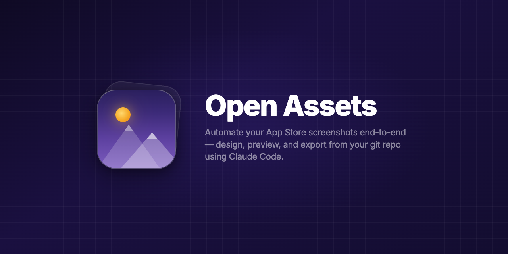
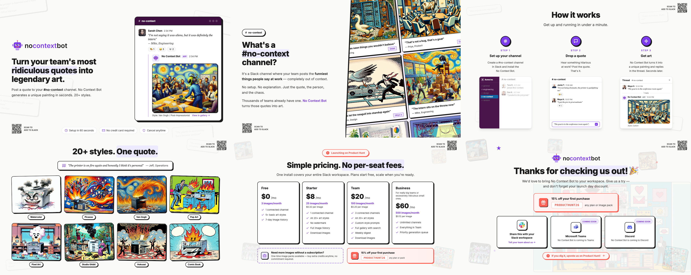

<p align="center">
  
</p>

# Open Assets

The LLM first way to do graphics all from your git repo. 

Dev server and export tool for app marketing assets. Like Storybook, but for marketing assets.

Design your App Store screenshots, app icons, logos, OG images, favicons, and more in HTML/CSS/SVG, preview them live in the browser, and export pixel-perfect PNGs at any size — including directly into your Xcode project.

## Examples

<p> <a href="https://onlyrecipes.app"><strong>Only Recipes</strong></a></p>


<p> <a href="https://apps.apple.com/us/app/cat-iq-test/id6759520249"><strong>Cat IQ Test</strong></a></p>


<p> <a href="https://nocontextbot.com"><strong>No Context Bot</strong></a></p>


## Installation

```bash
# npm
npm install --save-dev @open-assets/open-assets

# yarn
yarn add --dev @open-assets/open-assets

# pnpm
pnpm add --save-dev @open-assets/open-assets

# bun
bun add --dev @open-assets/open-assets
```

## Quick Start

```bash
# Scaffold a new project
npx open-assets init

# Start the dev server
npx open-assets dev
```

## Shell Alias

Add an alias to your shell profile for a shorter command:

```bash
echo 'alias oa="npx open-assets"' >> ~/.zshrc && source ~/.zshrc
```

Then use `oa` anywhere:

```bash
oa dev
oa render --all
oa init
```

## Concepts

open-assets uses a simple, unified data model. Every asset type follows the same structure: **N templates × M export sizes**.

| Term | Definition |
|------|-----------|
| **Collection** | A named group of related assets sharing the same source size and export sizes. One tab in the dev UI. |
| **Template** | A single source file (HTML or SVG) that produces one image per export size. |
| **Export Size** | A named output dimension that templates are rendered at (e.g., "iPhone 6.9" → 1320×2868). |
| **Source Size** | The dimensions the HTML template is authored at. Puppeteer scales from source → export size. |
| **Output** | An optional post-render action (e.g., write to Xcode `.appiconset`, copy SVG source). |

## End-to-End Screenshot Pipeline

### 1. Initialize

```bash
npx open-assets init
```

Creates a `assets.json`, sample HTML templates, and a `public/` directory for shared assets.

### 2. Design with Claude Code

Install the open-assets Claude Code skill into your project:

```bash
# Using the built-in command
npx open-assets skills

# Or using the Skills CLI
npx skills add https://github.com/Parra-Inc/open-assets --skill open-assets
```

This copies the skill into `.claude/skills/open-assets/` so Claude Code can use it. Then prompt:

```
Now we want to make beautiful screenshots for this app. Look at the marketing
doc and demographics. Design 8 high-converting App Store screenshots that catch
your eye as you scroll. Use bold headlines with highlighted keywords, phone
mockups with real app screenshots, and close with reviews + a CTA.
```

Claude reads your `assets.json` and `publicDir` to understand the project structure, then creates screenshot HTML files using the design patterns in the skill.

### 3. Preview

```bash
# With Tailwind
concurrently "npx @tailwindcss/cli -i src/styles.css -o dist/styles.css --watch" "npx open-assets dev"

# Without Tailwind
npx open-assets dev
```

Opens a live preview UI at `http://localhost:3200` with zoom/pan controls and export buttons.

### 4. Export

```bash
npx open-assets render --all
```

Exports every template at every configured export size into `./exports/`, organized as `exports/{collection}/{size}/{template}.png`.

### 5. Upload to App Store Connect / Google Play

Upload the exported PNGs to App Store Connect or Google Play Console. Each size subdirectory maps to a device size required by the store.

## Generating Screenshots from UI Tests

Capture real app screenshots via Playwright or XCTest, then use them inside your marketing screenshot templates:

```bash
# 1. Run UI tests to capture app screenshots into public/screenshots/
npx playwright test --project=screenshots

# 2. Export marketing screenshots with those captures embedded
npx open-assets render --all
```

Reference captured screenshots in your HTML templates:
```html

```

The `assets.json` `command` field stores the export command so automation tools know what to run:
```json
{
  "command": "npx open-assets render --all"
}
```

## CLI Commands

### `open-assets dev [dir]`

Start the dev server with a live preview UI and export controls.

```bash
open-assets dev                        # Use current directory
open-assets dev ./screenshots          # Use a specific directory
open-assets dev --port 4000            # Custom port (default: 3200)
open-assets dev --host 0.0.0.0         # Bind to all interfaces (network access)
open-assets dev --no-open              # Don't auto-open browser
open-assets dev --quiet                # Suppress server logs
open-assets dev --ci                   # CI mode (quiet + no browser)
open-assets dev --static-dir ./shared  # Serve additional static directories
open-assets dev --config config.json # Use a custom config filename
```

Options:
| Flag | Env Var | Default | Description |
|------|---------|---------|-------------|
| `-p, --port <port>` | `OPEN_ASSETS_PORT` | `3200` | Port to listen on |
| `-H, --host <host>` | `OPEN_ASSETS_HOST` | `localhost` | Host to bind to |
| `--no-open` | `OPEN_ASSETS_NO_OPEN` | — | Don't auto-open the browser |
| `-q, --quiet` | `OPEN_ASSETS_QUIET` | `false` | Suppress server logs |
| `--ci` | `CI` | `false` | CI mode: quiet + no browser |
| `--config <path>` | `OPEN_ASSETS_CONFIG` | `assets.json` | Path to config file |
| `--static-dir <dirs...>` | — | — | Additional static directories to serve |
| `--render-timeout <ms>` | `OPEN_ASSETS_RENDER_TIMEOUT` | `30000` | Puppeteer render timeout |

### `open-assets render [dir]`

Render assets headlessly via the command line, without opening a browser.

```bash
open-assets render                              # Render all collections at source size
open-assets render --all                        # Export at EVERY configured size
open-assets render --collection screenshots     # Render a specific collection
open-assets render --template 01-hero           # Render a single template
open-assets render --size iphone-6.9            # Use a named export size
open-assets render --width 1320 --height 2868   # Custom size
open-assets render --force                      # Re-render everything, ignore cache
open-assets render -o ./build                   # Custom output directory
open-assets render --json                       # Output results as JSON (for CI)
open-assets render --quiet                      # Suppress progress logs
```

Options:
| Flag | Env Var | Default | Description |
|------|---------|---------|-------------|
| `--collection <id>` | — | all | Render only the collection with this ID |
| `--template <name>` | — | all | Render only the template with this name |
| `--size <name>` | — | — | Use a named export size from config |
| `--width <px>` | — | — | Custom output width |
| `--height <px>` | — | — | Custom output height |
| `--all` | — | — | Export at every size defined in the config |
| `--force` | — | — | Re-render all assets even if unchanged |
| `-o, --output <dir>` | `OPEN_ASSETS_OUTPUT` | `./exports` | Output directory |
| `--config <path>` | `OPEN_ASSETS_CONFIG` | `assets.json` | Path to config file |
| `--parallel <count>` | `OPEN_ASSETS_PARALLEL` | `1` | Number of parallel renders |
| `--render-timeout <ms>` | `OPEN_ASSETS_RENDER_TIMEOUT` | `30000` | Puppeteer render timeout |
| `--json` | — | — | Output results as JSON |
| `-q, --quiet` | `OPEN_ASSETS_QUIET` | `false` | Suppress progress logs |

**Selective export** — flags compose naturally:
```bash
# Single template at a single device size
open-assets render --collection screenshots --template 01-hero --size iphone-6.9

# One template at all device sizes
open-assets render --collection screenshots --template 01-hero --all

# All templates at one device size
open-assets render --collection screenshots --size iphone-6.9
```

**Output structure**: `exports/{collection}/{size}/{template}.png`
```
exports/
  screenshots/
    iphone-6.9/
      01-hero.png
      02-features.png
    iphone-6.7/
      01-hero.png
      02-features.png
  icon/
    1024/
      icon.png
    180/
      icon.png
  logo/
    svg/
      logo.svg
      logo-dark.svg
    1024/
      logo.png
      logo-dark.png
```

### `open-assets list [dir]`

List all collections and templates defined in the config.

```bash
open-assets list              # Pretty-print asset tree
open-assets list --json       # Output as JSON
```

### `open-assets validate [dir]`

Validate the config and check that all referenced source files exist.

```bash
open-assets validate          # Check current directory
open-assets validate ./assets # Check specific directory
```

Returns exit code 1 if any errors are found — useful in CI pipelines.

### `open-assets skills [dir]`

Install Claude Code skills into your project. Copies skill files to `.claude/skills/` so Claude Code can generate and manage marketing assets.

```bash
open-assets skills            # Install to current project
open-assets skills ./my-app   # Install to a specific project

# Or using the Skills CLI
npx skills add https://github.com/Parra-Inc/open-assets --skill open-assets
```

### `open-assets init [dir]`

Scaffold a new project with a `assets.json`, sample HTML templates, and a `public/` directory.

```bash
open-assets init              # Current directory
open-assets init ./my-assets  # Specific directory
```

## Manifest Format

Your project needs a `assets.json` at its root. This file defines the collections shown in the viewer and all export options.

```json
{
  "version": 1,
  "name": "My App",
  "publicDir": "public",
  "command": "npx open-assets render --all",
  "collections": [ ... ]
}
```

### Root Fields

| Field | Type | Required | Description |
|-------|------|----------|-------------|
| `version` | number | yes | Manifest schema version (`1`) |
| `name` | string | yes | App display name |
| `publicDir` | string | no | Directory for shared assets (auto-served by dev server) |
| `command` | string | no | Export command for automation tools and CI |
| `collections` | array | yes | Asset collection definitions |

### Collection Schema (Unified)

All collections follow the same structure. No `type` field needed.

```json
{
  "id": "screenshots",
  "label": "App Store Screenshots",
  "sourceSize": { "width": 440, "height": 956 },
  "borderRadius": 4,
  "templates": [
    { "src": "src/screenshots/01-hero.html", "name": "01-hero", "label": "Hero" },
    { "src": "src/screenshots/02-features.html", "name": "02-features", "label": "Features" }
  ],
  "export": [
    { "name": "iphone-6.9", "label": "iPhone 6.9\"", "size": { "width": 1320, "height": 2868 } },
    { "name": "iphone-6.7", "label": "iPhone 6.7\"", "size": { "width": 1290, "height": 2796 } }
  ],
  "outputs": [
    { "type": "xcode", "path": "../MyApp/Assets.xcassets/AppIcon.appiconset" }
  ]
}
```

| Field | Type | Description |
|-------|------|-------------|
| `id` | string | Unique collection identifier (used in CLI `--collection`) |
| `label` | string | Display name in the collection selector |
| `sourceSize` | object | `{ width, height }` — the dimensions templates are authored at |
| `borderRadius` | number | Border radius for preview frames (px) |
| `templates` | array | Source files to render |
| `templates[].src` | string | Path to HTML/SVG file (relative to project root) |
| `templates[].name` | string | Filename for exports (used by `--template` flag) |
| `templates[].label` | string | Display label |
| `export` | array | Flat array of export size definitions |
| `export[].name` | string | Size identifier (used by `--size` flag) |
| `export[].label` | string | Display label |
| `export[].size` | object | `{ width, height }` — output dimensions in pixels |
| `export[].outFile` | string | Optional output path for this size (supports .png, .jpg) |
| `outputs` | array | Optional post-render actions |
| `customExport` | object | Optional `{ defaultWidth, defaultHeight }` for custom size UI |

### Output Types

| Type | Config | Description |
|------|--------|-------------|
| `xcode` | `{ "type": "xcode", "path": "..." }` | Render icon and write to Xcode asset catalog |
| `copy-source` | `{ "type": "copy-source", "format": "svg" }` | Copy source files to export directory |

### Example Collections

**Screenshots** (8 templates × 4 iPhone sizes):
```json
{
  "id": "screenshots",
  "label": "App Store Screenshots",
  "sourceSize": { "width": 440, "height": 956 },
  "borderRadius": 4,
  "templates": [
    { "src": "src/screenshots/01-hero.html", "name": "01-hero", "label": "Hero" },
    { "src": "src/screenshots/02-import.html", "name": "02-import", "label": "Import" }
  ],
  "export": [
    { "name": "iphone-6.9", "label": "iPhone 6.9\"", "size": { "width": 1320, "height": 2868 } },
    { "name": "iphone-6.7", "label": "iPhone 6.7\"", "size": { "width": 1290, "height": 2796 } },
    { "name": "iphone-6.5", "label": "iPhone 6.5\"", "size": { "width": 1284, "height": 2778 } },
    { "name": "iphone-6.1", "label": "iPhone 6.1\"", "size": { "width": 1179, "height": 2556 } }
  ]
}
```

**App Icon** (1 template × many Apple sizes + Xcode output):
```json
{
  "id": "icon",
  "label": "App Icon",
  "sourceSize": { "width": 1024, "height": 1024 },
  "borderRadius": 224,
  "templates": [
    { "src": "src/icon.html", "name": "icon", "label": "App Icon" }
  ],
  "export": [
    { "name": "1024", "label": "1024px", "size": { "width": 1024, "height": 1024 } },
    { "name": "180", "label": "180px", "size": { "width": 180, "height": 180 } },
    { "name": "120", "label": "120px", "size": { "width": 120, "height": 120 } }
  ],
  "outputs": [
    { "type": "xcode", "path": "../MyApp/Assets.xcassets/AppIcon.appiconset" }
  ]
}
```

**Icon Explorations** (3 concept variants × preview sizes):
```json
{
  "id": "icon-explorations",
  "label": "Icon Explorations",
  "sourceSize": { "width": 1024, "height": 1024 },
  "borderRadius": 224,
  "templates": [
    { "src": "src/icons/concept-a.html", "name": "concept-a", "label": "Concept A" },
    { "src": "src/icons/concept-b.html", "name": "concept-b", "label": "Concept B" },
    { "src": "src/icons/seasonal-winter.html", "name": "seasonal-winter", "label": "Winter" }
  ],
  "export": [
    { "name": "1024", "label": "1024px", "size": { "width": 1024, "height": 1024 } },
    { "name": "512", "label": "512px", "size": { "width": 512, "height": 512 } }
  ]
}
```

**Logo** (3 variants + SVG source copy):
```json
{
  "id": "logo",
  "label": "Logo",
  "sourceSize": { "width": 940, "height": 940 },
  "templates": [
    { "src": "src/logo.svg", "name": "logo", "label": "Logo" },
    { "src": "src/logo-dark.svg", "name": "logo-dark", "label": "Dark" },
    { "src": "src/wordmark.svg", "name": "wordmark", "label": "Wordmark" }
  ],
  "export": [
    { "name": "2048", "label": "2048px", "size": { "width": 2048, "height": 2048 } },
    { "name": "1024", "label": "1024px", "size": { "width": 1024, "height": 1024 } },
    { "name": "512", "label": "512px", "size": { "width": 512, "height": 512 } }
  ],
  "outputs": [
    { "type": "copy-source", "format": "svg" }
  ]
}
```

**OG Images** (social cards):
```json
{
  "id": "og-images",
  "label": "Social Cards",
  "sourceSize": { "width": 1200, "height": 630 },
  "templates": [
    { "src": "src/og/default.html", "name": "default", "label": "Default OG" }
  ],
  "export": [
    { "name": "og", "label": "OG Image", "size": { "width": 1200, "height": 630 } }
  ]
}
```

**Favicons** (1 template × many sizes):
```json
{
  "id": "favicon",
  "label": "Favicons",
  "sourceSize": { "width": 512, "height": 512 },
  "templates": [
    { "src": "src/favicon.html", "name": "favicon", "label": "Favicon" }
  ],
  "export": [
    { "name": "512", "label": "512px", "size": { "width": 512, "height": 512 } },
    { "name": "192", "label": "192px", "size": { "width": 192, "height": 192 } },
    { "name": "32", "label": "32px", "size": { "width": 32, "height": 32 }, "outFile": "public/favicon.png" },
    { "name": "16", "label": "16px", "size": { "width": 16, "height": 16 } },
    { "name": "apple-touch", "label": "Apple Touch Icon", "size": { "width": 180, "height": 180 }, "outFile": "public/apple-touch-icon.png" }
  ]
}
```

## Incremental Builds with assets.lock

The `render` command maintains a `assets.lock` file that stores SHA256 checksums of each source HTML/SVG file. On subsequent renders, unchanged assets are skipped automatically:

```
$ open-assets render --all
  Skipping 01-hero at 1320x2868 (unchanged)
  Rendering 03-new-screen at 1320x2868...
    → exports/screenshots/iphone-6.9/03-new-screen.png

Done. 1 asset(s) rendered, 1 skipped (unchanged) in 1.2s.
```

Use `--force` to re-render everything regardless of the cache.

**Limitation**: Only source HTML/SVG files are checksummed. Changes to referenced assets (images in `publicDir`, compiled Tailwind CSS) won't trigger re-renders — use `--force` when those change.

Add `assets.lock` to your `.gitignore` (done automatically by `open-assets init`).

## CI/CD with GitHub Actions

Automatically export screenshots on push:

```yaml
name: Export Marketing Assets
on:
  push:
    paths:
      - 'marketing/screenshots/**'
      - 'marketing/screenshots/assets.json'
jobs:
  export:
    runs-on: ubuntu-latest
    steps:
      - uses: actions/checkout@v4
      - uses: actions/setup-node@v4
        with:
          node-version: 20
      - run: npm ci
      - run: npx open-assets validate
      - run: npx open-assets render --all --json --quiet
      - uses: actions/upload-artifact@v4
        with:
          name: screenshots
          path: exports/
```

## Common Export Sizes

| Platform | Label | Width | Height |
|----------|-------|-------|--------|
| App Store | iPhone 6.9" | 1320 | 2868 |
| App Store | iPhone 6.7" | 1290 | 2796 |
| App Store | iPhone 6.5" | 1284 | 2778 |
| App Store | iPhone 6.1" | 1179 | 2556 |
| App Store | iPad 12.9" | 2048 | 2732 |
| Play Store | Phone | 1080 | 1920 |
| Play Store | Phone (tall) | 1080 | 2400 |
| Product Hunt | Gallery | 1270 | 760 |
| Web | OG Image | 1200 | 630 |
| Mac App Store | Retina | 2880 | 1800 |

## File Structure Convention

```
project/
  assets.json
  assets.lock              # Auto-generated cache (gitignored)
  public/                    # Shared assets (configured via publicDir)
    logo-round.png
    social/
      youtube.svg
    screenshots/             # Real app screenshots from UI tests
      01-home.png
  src/
    styles.css               # Tailwind input
    icon.html                # App icon template
    logo.svg                 # Vector logo template
    icons/                   # Icon concept explorations
      concept-a.html
      concept-b.html
    screenshots/
      01-hero.html
      02-features.html
    og/                      # OG image templates
      default.html
  dist/
    styles.css               # Compiled Tailwind
  exports/                   # Rendered output (gitignored)
    screenshots/
      iphone-6.9/
        01-hero.png
      iphone-6.7/
    icon/
      1024/
        icon.png
    logo/
      svg/
        logo.svg
```

## License

MIT
