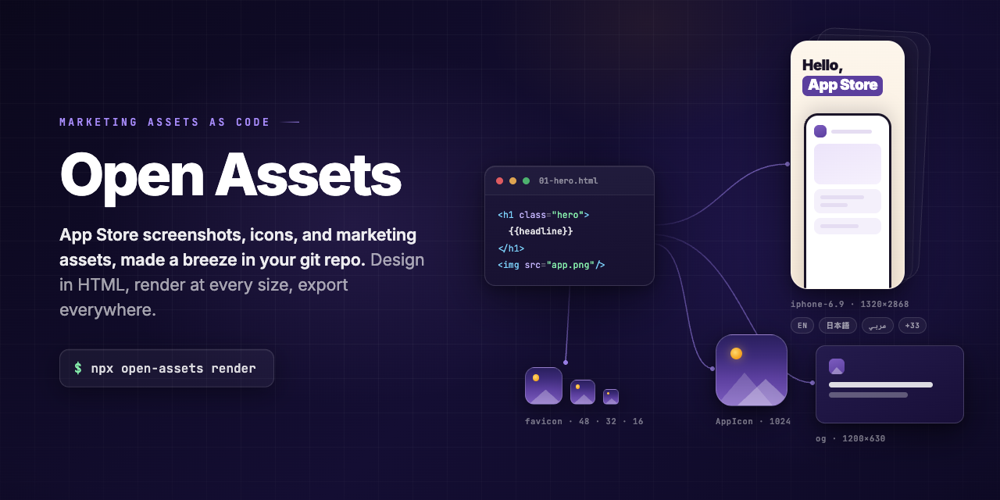
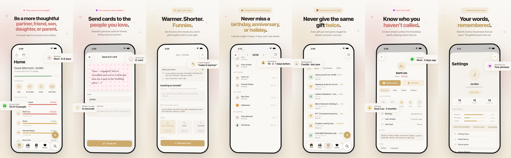
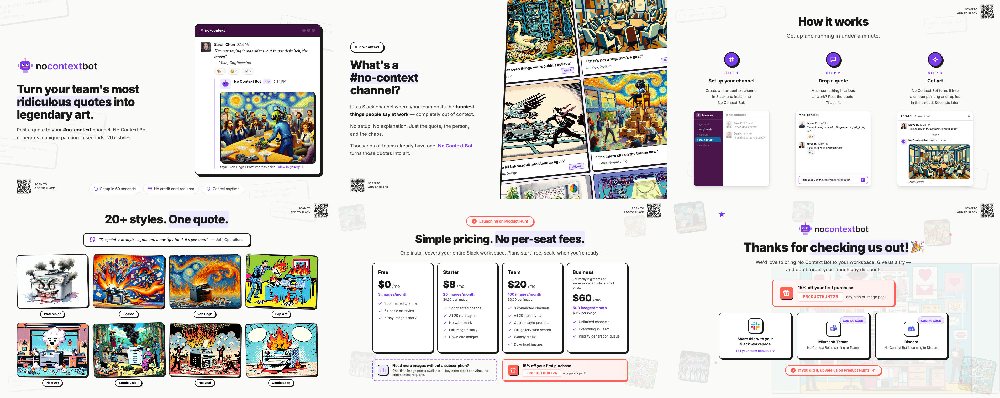

<p align="center">
  
</p>

# Open Assets

[](https://www.npmjs.com/package/@open-assets/open-assets)
[](LICENSE)
[](#2-design-with-claude-code)

**Screenshots, icons, and marketing assets, made a breeze in your git repo.**

Design App Store screenshots, app icons, logos, OG images, and favicons as HTML/CSS/SVG templates. Preview them live in the browser. Render every size your stores need from a single template with one command, then export the results anywhere: your exports folder, your web app's public directory, or straight into an Xcode asset catalog.

Like Storybook, but for marketing assets. Free, local, MIT licensed, and built for AI coding agents.

## Why Open Assets

- **One template, every size.** Author a screenshot once at its source size and render it for iPhone 6.9", 6.7", iPad, Play Store, Product Hunt, and any custom dimension. No per-device rework.
- **Export to multiple locations.** Each export size can write to its own destination with `outFile`: drop `favicon.png` into `public/`, send the OG image to your web app, and write the app icon directly into your Xcode `.appiconset`.
- **Localization built in.** One template renders in every language. Mustache-style `{{placeholders}}`, locale-aware number formatting, and automatic RTL layout for Arabic, Hebrew, and friends. See [Localization](#localization).
- **Live preview dev server.** A Storybook-style UI with hot reload, zoom/pan, and one-click exports while you iterate on templates.
- **Incremental renders.** `assets.lock` checksums every source file, so you, your teammates, and CI only re-render what changed.
- **Versioned in git, rendered in CI.** No SaaS, no per-seat design tool. Review screenshot changes in a PR with `git diff`, re-render on every push with GitHub Actions.
- **Agent native.** Ships a Claude Code skill (`npx open-assets skills`), so your agent can design, localize, and render the entire asset set for you.

## Examples

<p> <a href="https://apps.apple.com/us/app/tax-days-residency-tracker/id6761441335"><strong>Tax Days</strong></a> (<a href="examples/tax-days">examples</a>)</p>


<p> <a href="https://apps.apple.com/us/app/only-recipes-recipe-keeper/id1553858589"><strong>Only Recipes</strong></a> (<a href="examples/only-recipes">examples</a>)</p>


<p> <a href="https://apps.apple.com/us/app/thoughtful-grow-relationships/id6762098726"><strong>Thoughtful</strong></a> (<a href="examples/thoughtful">examples</a>)</p>


<p> <a href="https://apps.apple.com/us/app/cat-iq-test/id6759520249"><strong>Cat IQ Test</strong></a> (<a href="examples/cat-iq-test">examples</a>)</p>


<p> <a href="https://nocontextbot.com"><strong>No Context Bot</strong></a> (<a href="examples/no-context">examples</a>)</p>


## Installation

```bash
# npm
npm install --save-dev @open-assets/open-assets

# yarn
yarn add --dev @open-assets/open-assets

# pnpm
pnpm add --save-dev @open-assets/open-assets

# bun
bun add --dev @open-assets/open-assets
```

## Quick Start

```bash
# Scaffold a new project
npx open-assets init

# Start the dev server
npx open-assets dev
```

## Shell Alias

Add an alias to your shell profile for a shorter command:

```bash
echo 'alias oa="npx open-assets"' >> ~/.zshrc && source ~/.zshrc
```

Then use `oa` anywhere:

```bash
oa dev
oa render
oa init
```

## Concepts

open-assets uses a simple, unified data model. Every asset type follows the same structure: **N templates × M export sizes**.

| Term | Definition |
|------|-----------|
| **Collection** | A named group of related assets sharing the same source size and export sizes. One tab in the dev UI. |
| **Template** | A single source file (HTML or SVG) that produces one image per export size. |
| **Export Size** | A named output dimension that templates are rendered at (e.g., "iPhone 6.9" → 1320×2868). |
| **Source Size** | The dimensions the HTML template is authored at. Puppeteer scales from source → export size. |
| **Output** | An optional post-render action (e.g., write to Xcode `.appiconset`, copy SVG source). |

### One template, many sizes, many destinations

Every entry in a collection's `export` array is either a size or an output action. A single template renders to all of them in one pass:

```json
"export": [
  { "name": "iphone-6.9", "label": "iPhone 6.9\"", "size": { "width": 1320, "height": 2868 } },
  { "name": "iphone-6.7", "label": "iPhone 6.7\"", "size": { "width": 1290, "height": 2796 } },
  { "name": "favicon", "size": { "width": 32, "height": 32 }, "outFile": "public/favicon.png" },
  { "type": "xcode", "path": "../MyApp/Assets.xcassets/AppIcon.appiconset" }
]
```

- Sized entries land in `exports/{collection}/{size}/{template}.png`
- `outFile` sends a rendered size anywhere in your repo (`.png` or `.jpg`), like your web app's `public/` directory
- `xcode` fills an Xcode `.appiconset` directly
- `copy-source` copies SVG sources alongside the rendered PNGs

Change the template once, run `npx open-assets render`, and every destination updates. Unchanged templates are skipped automatically.

## End-to-End Screenshot Pipeline

### 1. Initialize

```bash
npx open-assets init
```

Creates a `assets.json`, sample HTML templates, and a `public/` directory for shared assets.

### 2. Design with Claude Code

The easiest way to get the skill is the Claude Code plugin marketplace. Inside Claude Code, run:

```
/plugin marketplace add Parra-Inc/open-assets
/plugin install open-assets@open-assets
```

The skill is installed once, works in every project, and updates with `/plugin marketplace update open-assets`.

Alternatively, copy the skill into a single project:

```bash
# Using the built-in command
npx open-assets skills

# Or using the Skills CLI
npx skills add https://github.com/Parra-Inc/open-assets --skill open-assets
```

This copies the skill into `.claude/skills/open-assets/` so Claude Code can use it. Then prompt:

```
Now we want to make beautiful screenshots for this app. Look at the marketing
doc and demographics. Design 8 high-converting App Store screenshots that catch
your eye as you scroll. Use bold headlines with highlighted keywords, phone
mockups with real app screenshots, and close with reviews + a CTA.
```

Claude reads your `assets.json` and `publicDir` to understand the project structure, then creates screenshot HTML files using the design patterns in the skill.

### 3. Preview

```bash
# With Tailwind
concurrently "npx @tailwindcss/cli -i assets/styles.css -o dist/styles.css --watch" "npx open-assets dev"

# Without Tailwind
npx open-assets dev
```

Opens a live preview UI at `http://localhost:3200` with zoom/pan controls and export buttons.

### 4. Export

```bash
npx open-assets render
```

Exports every template at every configured export size into `./exports/`, skipping anything that hasn't changed, organized as `exports/{collection}/{size}/{template}.png`.

### 5. Upload to App Store Connect / Google Play

Upload the exported PNGs to App Store Connect or Google Play Console. Each size subdirectory maps to a device size required by the store.

## Generating Screenshots from UI Tests

Capture real app screenshots via Playwright or XCTest, then use them inside your marketing screenshot templates:

```bash
# 1. Run UI tests to capture app screenshots into public/screenshots/
npx playwright test --project=screenshots

# 2. Export marketing screenshots with those captures embedded
# (--force because captured images aren't checksummed by the cache)
npx open-assets render --force
```

Reference captured screenshots in your HTML templates:
```html

```

The `assets.json` `command` field stores the export command so automation tools know what to run:
```json
{
  "command": "npx open-assets render"
}
```

## Localization

Ship screenshots in every language you support, from the same templates. Add a localizations file (an iOS `.xcstrings`-inspired format), reference keys in templates with `{{key}}`, and every template renders once per locale:

```json
{
  "sourceLanguage": "en",
  "strings": {
    "hero_title": {
      "localizations": {
        "en": { "value": "Track your tax days" },
        "de": { "value": "Verfolge deine Steuertage" },
        "ja": { "value": "税金の日を追跡する" },
        "ar": { "value": "تتبع أيام الضرائب الخاصة بك" }
      }
    }
  }
}
```

Wire it to a collection in `assets.json`:

```json
{
  "id": "screenshots",
  "localizations": "localizations.json",
  "locales": ["en", "de", "ja", "ar"]
}
```

Then use the keys in any template:

```html
<h1>{{hero_title}}</h1>
```

What you get:

- **Per-locale exports**: output paths become `exports/{collection}/{locale}/{size}/{template}.png`, ready for App Store Connect's per-language screenshot slots
- **RTL support**: right-to-left locales (Arabic, Hebrew, Persian, Urdu) automatically render with `dir="rtl"` set on the document
- **Locale-aware numbers**: `{{n:1234}}` renders as `1,234` in English and `1.234` in German via `Intl.NumberFormat`
- **Fallback chain**: exact locale (`es-419`), then base language (`es`), then the source language

Render all locales, or just one:

```bash
npx open-assets render --collection screenshots               # every locale
npx open-assets render --collection screenshots --locale ja   # just Japanese
```

## CLI Commands

### `open-assets dev [dir]`

Start the dev server with a live preview UI and export controls.

```bash
open-assets dev                        # Use current directory
open-assets dev ./screenshots          # Use a specific directory
open-assets dev --port 4000            # Custom port (default: 3200)
open-assets dev --host 0.0.0.0         # Bind to all interfaces (network access)
open-assets dev --no-open              # Don't auto-open browser
open-assets dev --quiet                # Suppress server logs
open-assets dev --ci                   # CI mode (quiet + no browser)
open-assets dev --static-dir ./shared  # Serve additional static directories
open-assets dev --config config.json # Use a custom config filename
```

Options:
| Flag | Env Var | Default | Description |
|------|---------|---------|-------------|
| `-p, --port <port>` | `OPEN_ASSETS_PORT` | `3200` | Port to listen on |
| `-H, --host <host>` | `OPEN_ASSETS_HOST` | `localhost` | Host to bind to |
| `--no-open` | `OPEN_ASSETS_NO_OPEN` | — | Don't auto-open the browser |
| `-q, --quiet` | `OPEN_ASSETS_QUIET` | `false` | Suppress server logs |
| `--ci` | `CI` | `false` | CI mode: quiet + no browser |
| `--config <path>` | `OPEN_ASSETS_CONFIG` | `assets.json` | Path to config file |
| `--static-dir <dirs...>` | — | — | Additional static directories to serve |
| `--render-timeout <ms>` | `OPEN_ASSETS_RENDER_TIMEOUT` | `30000` | Puppeteer render timeout |

### `open-assets render [dir]`

Render assets headlessly via the command line, without opening a browser.

```bash
open-assets render                              # Render everything at every export size
open-assets render --force                      # Re-render everything, ignoring the cache
open-assets render --collection screenshots     # Render a specific collection
open-assets render --template 01-hero           # Render a single template
open-assets render --size iphone-6.9            # Use a named export size
open-assets render --width 1320 --height 2868   # Custom size
open-assets render -o ./build                   # Custom output directory
open-assets render --json                       # Output results as JSON (for CI)
open-assets render --quiet                      # Suppress progress logs
```

Options:
| Flag | Env Var | Default | Description |
|------|---------|---------|-------------|
| `--collection <id>` | — | all | Render only the collection with this ID |
| `--tag <tag>` | — | all | Render only collections with this tag |
| `--template <name>` | — | all | Render only the template with this name |
| `--size <name>` | — | — | Use a named export size from config |
| `--locale <code>` | — | all | Render only this locale (e.g. `en`, `ar`, `ja`) |
| `--width <px>` | — | — | Custom output width |
| `--height <px>` | — | — | Custom output height |
| `-f, --force` | — | — | Re-render everything, ignoring the incremental cache |
| `-o, --output <dir>` | `OPEN_ASSETS_OUTPUT` | `./exports` | Output directory |
| `--config <path>` | `OPEN_ASSETS_CONFIG` | `assets.json` | Path to config file |
| `--render-timeout <ms>` | `OPEN_ASSETS_RENDER_TIMEOUT` | `30000` | Puppeteer render timeout |
| `--json` | — | — | Output results as JSON |
| `-q, --quiet` | `OPEN_ASSETS_QUIET` | `false` | Suppress progress logs |

**Selective export**: flags compose naturally:
```bash
# Single template at a single device size
open-assets render --collection screenshots --template 01-hero --size iphone-6.9

# One template at all device sizes
open-assets render --collection screenshots --template 01-hero

# All templates at one device size
open-assets render --collection screenshots --size iphone-6.9

# All templates in one language
open-assets render --collection screenshots --locale ja
```

**Output structure**: `exports/{collection}/{size}/{template}.png`
```
exports/
  screenshots/
    iphone-6.9/
      01-hero.png
      02-features.png
    iphone-6.7/
      01-hero.png
      02-features.png
  icon/
    1024/
      icon.png
    180/
      icon.png
  logo/
    svg/
      logo.svg
      logo-dark.svg
    1024/
      logo.png
      logo-dark.png
```

### `open-assets list [dir]`

List all collections and templates defined in the config.

```bash
open-assets list              # Pretty-print asset tree
open-assets list --json       # Output as JSON
```

### `open-assets validate [dir]`

Validate the config and check that all referenced source files exist.

```bash
open-assets validate          # Check current directory
open-assets validate ./assets # Check specific directory
```

Returns exit code 1 if any errors are found, useful in CI pipelines.

### `open-assets skills [dir]`

Install Claude Code skills into your project. Copies skill files to `.claude/skills/` so Claude Code can generate and manage marketing assets.

```bash
open-assets skills            # Install to current project
open-assets skills ./my-app   # Install to a specific project

# Or using the Skills CLI
npx skills add https://github.com/Parra-Inc/open-assets --skill open-assets
```

Prefer a global, per-user install? Use the Claude Code plugin marketplace instead: the skill then works in every project without copying files:

```
/plugin marketplace add Parra-Inc/open-assets
/plugin install open-assets@open-assets
```

### `open-assets init [dir]`

Scaffold a new project with a `assets.json`, sample HTML templates, and a `public/` directory.

```bash
open-assets init              # Current directory
open-assets init ./my-assets  # Specific directory
```

## Manifest Format

Your project needs a `assets.json` at its root. This file defines the collections shown in the viewer and all export options.

```json
{
  "version": 1,
  "name": "My App",
  "publicDir": "public",
  "command": "npx open-assets render",
  "collections": [ ... ]
}
```

### Root Fields

| Field | Type | Required | Description |
|-------|------|----------|-------------|
| `version` | number | yes | Manifest schema version (`1`) |
| `name` | string | yes | App display name |
| `publicDir` | string | no | Directory for shared assets (auto-served by dev server) |
| `command` | string | no | Export command for automation tools and CI |
| `tags` | array | no | Tag definitions (`{ id, label }`) for grouping collections |
| `collections` | array | yes | Asset collection definitions |

### Collection Schema (Unified)

All collections follow the same structure. No `type` field needed.

```json
{
  "id": "screenshots",
  "label": "App Store Screenshots",
  "sourceSize": { "width": 440, "height": 956 },
  "borderRadius": 4,
  "templates": [
    { "src": "assets/screenshots/01-hero.html", "name": "01-hero", "label": "Hero" },
    { "src": "assets/screenshots/02-features.html", "name": "02-features", "label": "Features" }
  ],
  "export": [
    { "name": "iphone-6.9", "label": "iPhone 6.9\"", "size": { "width": 1320, "height": 2868 } },
    { "name": "iphone-6.7", "label": "iPhone 6.7\"", "size": { "width": 1290, "height": 2796 } },
    { "type": "xcode", "path": "../MyApp/Assets.xcassets/AppIcon.appiconset" }
  ]
}
```

| Field | Type | Description |
|-------|------|-------------|
| `id` | string | Unique collection identifier (used in CLI `--collection`) |
| `label` | string | Display name in the collection selector |
| `tags` | array | Tag ids applied to this collection (filter renders with `--tag`) |
| `sourceSize` | object | `{ width, height }`: the dimensions templates are authored at |
| `borderRadius` | number | Border radius for preview frames (px) |
| `localizations` | string | Path to a localizations JSON file (see [Localization](#localization)) |
| `locales` | array | Optional locale filter. Omit to render every locale in the localizations file |
| `templates` | array | Source files to render |
| `templates[].src` | string | Path to HTML/SVG file (relative to project root) |
| `templates[].name` | string | Filename for exports (used by `--template` flag) |
| `templates[].label` | string | Display label |
| `export` | array | Array of export sizes and output actions |
| `export[].name` | string | Size identifier (used by `--size` flag) |
| `export[].label` | string | Display label |
| `export[].size` | object | `{ width, height }`: output dimensions in pixels |
| `export[].outFile` | string | Optional output path for this size (supports .png, .jpg) |
| `export[].type` | string | Output action type (`xcode`, `copy-source`). Entries with `type` are post-render actions, not sizes |
| `customExport` | object | Optional `{ defaultWidth, defaultHeight }` for custom size UI |

### Output Types

Export entries with a `type` field are post-render actions that run after every render:

| Type | Config | Description |
|------|--------|-------------|
| `xcode` | `{ "type": "xcode", "path": "..." }` | Render icon and write to Xcode asset catalog |
| `copy-source` | `{ "type": "copy-source", "format": "svg" }` | Copy source files to export directory |

### Example Collections

**Screenshots** (8 templates × 4 iPhone sizes):
```json
{
  "id": "screenshots",
  "label": "App Store Screenshots",
  "sourceSize": { "width": 440, "height": 956 },
  "borderRadius": 4,
  "templates": [
    { "src": "assets/screenshots/01-hero.html", "name": "01-hero", "label": "Hero" },
    { "src": "assets/screenshots/02-import.html", "name": "02-import", "label": "Import" }
  ],
  "export": [
    { "name": "iphone-6.9", "label": "iPhone 6.9\"", "size": { "width": 1320, "height": 2868 } },
    { "name": "iphone-6.7", "label": "iPhone 6.7\"", "size": { "width": 1290, "height": 2796 } },
    { "name": "iphone-6.5", "label": "iPhone 6.5\"", "size": { "width": 1284, "height": 2778 } },
    { "name": "iphone-6.1", "label": "iPhone 6.1\"", "size": { "width": 1179, "height": 2556 } }
  ]
}
```

**App Icon** (1 template × many Apple sizes + Xcode output):
```json
{
  "id": "icon",
  "label": "App Icon",
  "sourceSize": { "width": 1024, "height": 1024 },
  "borderRadius": 224,
  "templates": [
    { "src": "assets/icon.html", "name": "icon", "label": "App Icon" }
  ],
  "export": [
    { "name": "1024", "label": "1024px", "size": { "width": 1024, "height": 1024 } },
    { "name": "180", "label": "180px", "size": { "width": 180, "height": 180 } },
    { "name": "120", "label": "120px", "size": { "width": 120, "height": 120 } },
    { "type": "xcode", "path": "../MyApp/Assets.xcassets/AppIcon.appiconset" }
  ]
}
```

**Icon Explorations** (3 concept variants × preview sizes):
```json
{
  "id": "icon-explorations",
  "label": "Icon Explorations",
  "sourceSize": { "width": 1024, "height": 1024 },
  "borderRadius": 224,
  "templates": [
    { "src": "assets/icons/concept-a.html", "name": "concept-a", "label": "Concept A" },
    { "src": "assets/icons/concept-b.html", "name": "concept-b", "label": "Concept B" },
    { "src": "assets/icons/seasonal-winter.html", "name": "seasonal-winter", "label": "Winter" }
  ],
  "export": [
    { "name": "1024", "label": "1024px", "size": { "width": 1024, "height": 1024 } },
    { "name": "512", "label": "512px", "size": { "width": 512, "height": 512 } }
  ]
}
```

**Logo** (3 variants + SVG source copy):
```json
{
  "id": "logo",
  "label": "Logo",
  "sourceSize": { "width": 940, "height": 940 },
  "templates": [
    { "src": "assets/logo.svg", "name": "logo", "label": "Logo" },
    { "src": "assets/logo-dark.svg", "name": "logo-dark", "label": "Dark" },
    { "src": "assets/wordmark.svg", "name": "wordmark", "label": "Wordmark" }
  ],
  "export": [
    { "name": "2048", "label": "2048px", "size": { "width": 2048, "height": 2048 } },
    { "name": "1024", "label": "1024px", "size": { "width": 1024, "height": 1024 } },
    { "name": "512", "label": "512px", "size": { "width": 512, "height": 512 } },
    { "type": "copy-source", "format": "svg" }
  ]
}
```

**OG Images** (social cards):
```json
{
  "id": "og-images",
  "label": "Social Cards",
  "sourceSize": { "width": 1200, "height": 630 },
  "templates": [
    { "src": "assets/og/default.html", "name": "default", "label": "Default OG" }
  ],
  "export": [
    { "name": "og", "label": "OG Image", "size": { "width": 1200, "height": 630 } }
  ]
}
```

**Favicons** (1 template × many sizes):
```json
{
  "id": "favicon",
  "label": "Favicons",
  "sourceSize": { "width": 512, "height": 512 },
  "templates": [
    { "src": "assets/favicon.html", "name": "favicon", "label": "Favicon" }
  ],
  "export": [
    { "name": "512", "label": "512px", "size": { "width": 512, "height": 512 } },
    { "name": "192", "label": "192px", "size": { "width": 192, "height": 192 } },
    { "name": "32", "label": "32px", "size": { "width": 32, "height": 32 }, "outFile": "public/favicon.png" },
    { "name": "16", "label": "16px", "size": { "width": 16, "height": 16 } },
    { "name": "apple-touch", "label": "Apple Touch Icon", "size": { "width": 180, "height": 180 }, "outFile": "public/apple-touch-icon.png" }
  ]
}
```

## Incremental Builds with assets.lock

The `render` command maintains a `assets.lock` file that stores SHA256 checksums of each source HTML/SVG file. On subsequent renders, unchanged assets are skipped automatically:

```
$ open-assets render
  Skipping 01-hero at 1320x2868 (unchanged)
  Rendering 03-new-screen at 1320x2868...
    → exports/screenshots/iphone-6.9/03-new-screen.png

Done. 1 asset(s) rendered, 1 skipped (unchanged) in 1.2s.
```

Use `--force` to re-render everything regardless of the cache.

**Limitation**: Only source HTML/SVG files are checksummed. Changes to referenced assets (images in `publicDir`, compiled Tailwind CSS) won't trigger re-renders, so use `--force` when those change.

Commit `assets.lock` to your repository so teammates and CI benefit from the cache.

## CI/CD with GitHub Actions

Automatically export screenshots on push:

```yaml
name: Export Marketing Assets
on:
  push:
    paths:
      - 'marketing/screenshots/**'
      - 'marketing/screenshots/assets.json'
jobs:
  export:
    runs-on: ubuntu-latest
    steps:
      - uses: actions/checkout@v4
      - uses: actions/setup-node@v4
        with:
          node-version: 20
      - run: npm ci
      - run: npx open-assets validate
      - run: npx open-assets render --json --quiet
      - uses: actions/upload-artifact@v4
        with:
          name: screenshots
          path: exports/
```

## Common Export Sizes

| Platform | Label | Width | Height |
|----------|-------|-------|--------|
| App Store | iPhone 6.9" | 1320 | 2868 |
| App Store | iPhone 6.7" | 1290 | 2796 |
| App Store | iPhone 6.5" | 1284 | 2778 |
| App Store | iPhone 6.1" | 1179 | 2556 |
| App Store | iPad 12.9" | 2048 | 2732 |
| Play Store | Phone | 1080 | 1920 |
| Play Store | Phone (tall) | 1080 | 2400 |
| Product Hunt | Gallery | 1270 | 760 |
| Web | OG Image | 1200 | 630 |
| Mac App Store | Retina | 2880 | 1800 |

## File Structure Convention

```
project/
  assets.json
  assets.lock              # Auto-generated cache (commit this)
  localizations.json         # Localized strings (optional)
  public/                    # Shared assets (configured via publicDir)
    logo-round.png
    social/
      youtube.svg
    screenshots/             # Real app screenshots from UI tests
      01-home.png
  assets/
    styles.css               # Tailwind input
    icon.html                # App icon template
    logo.svg                 # Vector logo template
    icons/                   # Icon concept explorations
      concept-a.html
      concept-b.html
    screenshots/
      01-hero.html
      02-features.html
    og/                      # OG image templates
      default.html
  dist/
    styles.css               # Compiled Tailwind
  exports/                   # Rendered output (commit this)
    screenshots/
      iphone-6.9/
        01-hero.png
      iphone-6.7/
    icon/
      1024/
        icon.png
    logo/
      svg/
        logo.svg
```

## License

MIT
